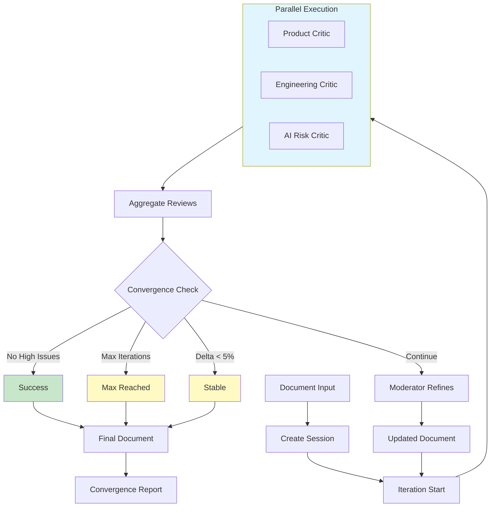

# AI Agent Orchestration Platform

> A production-ready Python framework for multi-agent AI orchestration, demonstrating advanced software engineering patterns including async/await, WebSockets, LangChain integration, and clean architecture.

[](https://www.python.org/downloads/)
[](https://fastapi.tiangolo.com/)
[](https://langchain.com/)

## Project Overview

This platform orchestrates multiple AI agents in "roundtable" sessions where they collaboratively review and refine documents through iterative feedback loops. Originally built for PRD (Product Requirements Document) refinement, the architecture generalizes to any document review workflow.

**Key Achievement:** Reduced average document refinement time from manual hours to automated minutes while maintaining quality through multi-perspective AI review.

## Technical Highlights

| Category | Technologies & Patterns |
|----------|------------------------|
| **Backend** | Python 3.10+, FastAPI, Pydantic, async/await |
| **AI/ML** | LangChain, OpenAI GPT, Google Gemini, Anthropic Claude |
| **Real-time** | WebSockets, Server-Sent Events |
| **Architecture** | Clean Architecture, Protocol-based interfaces, Factory pattern |
| **Frontend** | React, TypeScript, Vite, Tailwind CSS, WebSocket client |
| **Testing** | pytest, async test fixtures |

## System Flow



## Architecture

```
ai-agent-orchestration-platform/
├── src/ai_orchestrator/           # Core library package
│   ├── types.py                   # Protocol-based interfaces
│   ├── convergence.py             # Stop condition algorithms
│   ├── orchestration/             # Orchestration engines
│   │   ├── runner.py              # run_roundtable implementation
│   │   ├── looping_orchestrator.py
│   │   └── dynamic_orchestrator.py
│   ├── agents/                    # Pluggable AI agents
│   │   ├── prd_critic.py          # Product quality reviewer
│   │   ├── engineering_critic.py  # Technical feasibility reviewer
│   │   ├── ai_risk_critic.py      # AI safety reviewer
│   │   ├── moderator.py           # Document refiner
│   │   ├── dynamic_critic.py      # Configurable critic
│   │   └── meta_orchestrator.py   # AI-generated roundtables
│   ├── plugins/                   # Extensibility system
│   │   ├── memory_store.py        # Memory store interface
│   │   ├── model_provider.py      # LLM provider interface
│   │   └── retriever.py           # RAG retriever interface
│   ├── storage/                   # Persistence layer
│   │   ├── prd_storage.py         # JSON file storage
│   │   ├── memory_inmemory.py     # In-memory store
│   │   └── memory_sqlite.py       # SQLite store
│   └── utils/                     # Utilities
│       ├── llm_factory.py         # Multi-provider LLM factory
│       └── logger.py              # Logging infrastructure
├── api/                           # FastAPI REST + WebSocket server
│   ├── routes/                    # Endpoint handlers
│   │   ├── refinement.py          # Refinement start/status/continue
│   │   ├── sessions.py            # Session CRUD
│   │   ├── upload.py              # File upload handling
│   │   └── websocket.py           # Real-time updates
│   └── services/                  # Business logic
│       ├── async_orchestrator.py  # Async refinement service
│       └── dynamic_async_orchestrator.py
├── execution-gui/                 # React frontend (TypeScript/Vite)
│   └── src/
│       ├── components/            # React components
│       ├── pages/                 # Page components
│       ├── hooks/                 # Custom React hooks
│       └── api.ts                 # API client
├── ui/                            # Legacy web dashboard (vanilla JS)
├── tests/                         # Test suite
├── docs/                          # Documentation
├── data/prds/                     # Session storage
├── main.py                        # CLI entry point
└── run_api.py                     # API server entry point
```

## Key Features

### Multi-Agent Orchestration
- **Parallel Agent Execution**: Critics run concurrently for 2-3x speedup
- **Convergence Detection**: Automatic stopping when quality thresholds met
- **Session Persistence**: JSON-based versioning with full audit trail

### Multi-Provider LLM Support
- OpenAI (GPT-4, GPT-5 series)
- Google Gemini (1M token context window)
- Anthropic Claude
- Factory pattern for seamless provider switching

### Real-time Updates
- WebSocket broadcasting with 7 event types
- Live progress visualization
- Reconnection handling with exponential backoff

### Plugin Architecture
- **Memory Stores**: In-memory and SQLite implementations
- **Model Providers**: Abstract LLM interface for custom providers
- **Retrievers**: RAG-ready retriever interface for context injection

### Clean Public API
```python
from ai_orchestrator import run_roundtable, RoundtableConfig

result = run_roundtable(
    document="# My Document\n\nContent to refine...",
    agents=[ProductCritic(), EngineeringCritic()],
    moderator=DocumentModerator(),
    config=RoundtableConfig(max_iterations=3),
)

print(f"Converged: {result.converged}")
print(f"Final document:\n{result.final_document}")
```

## Quick Start

### Installation

```bash
# Clone and install
git clone https://github.com/va2ai/ai-agent-orchestration-platform.git
cd ai-agent-orchestration-platform
pip install -e ".[all-providers]"

# Configure API keys
cp .env.example .env
# Add: OPENAI_API_KEY, GOOGLE_API_KEY (optional)
```

### Run the Web Dashboard

**Option A: FastAPI + Vanilla JS (Production)**
```bash
python run_api.py
# Open http://localhost:8000
```

**Option B: React Frontend (Development)**
```bash
cd execution-gui
npm install
npm run dev
# Open http://localhost:5173
```

### Run via CLI

```bash
python main.py --input document.md --title "My PRD" --max-iterations 3
```

## Documentation

| Document | Description |
|----------|-------------|
| [API Dashboard](docs/API_DASHBOARD.md) | REST API and WebSocket documentation |
| [Agents Guide](docs/AGENTS.md) | Built-in agents and custom agent development |
| [Dynamic System](docs/DYNAMIC_SYSTEM.md) | AI-generated roundtable configuration |
| [Gemini Setup](docs/GEMINI_SETUP.md) | Google Gemini integration guide |
| [Logging](docs/LOGGING.md) | Comprehensive logging system |
| [Quick Start](docs/QUICKSTART.md) | Getting started guide |

## Design Patterns Demonstrated

- **Protocol-based Interfaces**: Type-safe agent contracts without inheritance coupling
- **Factory Pattern**: LLM provider abstraction for multi-model support
- **Async Orchestration**: Non-blocking parallel execution with asyncio
- **Event-driven Architecture**: WebSocket pub/sub for real-time updates
- **Strategy Pattern**: Configurable convergence algorithms
- **Repository Pattern**: Session storage abstraction

## Testing

```bash
# Run all tests
pytest

# Run with coverage
pytest --cov=ai_orchestrator

# Run API tests
python test_api.py
```

## Performance

- **Async Orchestrator**: 2-3 minutes vs 4 minutes (CLI sync version)
- **Parallel Critics**: 3 agents execute concurrently
- **Token Tracking**: Per-agent usage monitoring
- **Session Resume**: Continue refinement without losing progress

## License

MIT

## Contributing

Contributions welcome! Please open an issue or submit a pull request.
